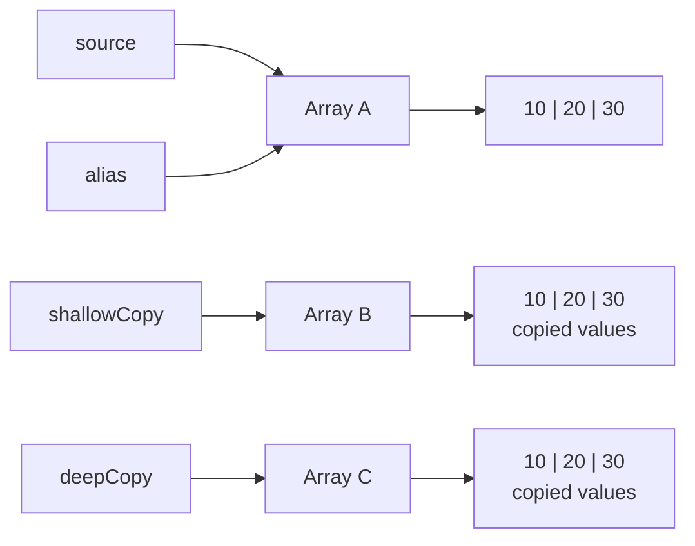
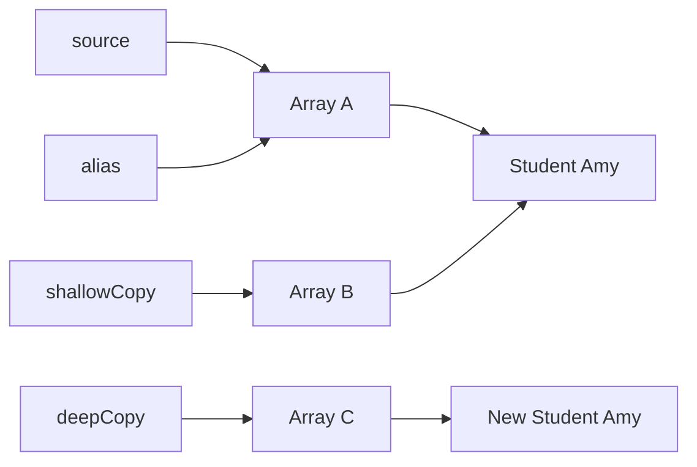

## Array Comparisons

Think of an array as a box containing items:

- Alias: same box
- Shallow copy: new box, same objects inside
- Deep copy: new box, new objects inside

For primitives, 
- shallow and deep copies behave identically because the array stores actual values ── not references to objects. 
- Only the alias shares the original array.

### Array of Primitives



### Array of objects



## Primitives versus Object Arrays

- **Primitive arrays** such as int[] **stores values directly**.
- There is no meaningful shallow-versus-deep distinction. A copied int[] has independent values.

- **Object arrays** such as Student[] stores references.
- Therefore, shallow and deep copying matter.

### One important Java detail

For custom objects, `Arrays.equals ()` depends on the element class’s equals () implementation.

- If the element class's does not override equals (), independently created students are considered unequal by
  default—even if their attributes match.

Similarly, Arrays.compare () needs either:

- Elements implementing Comparable, or
- A supplied Comparator<Student>

The shortest memory rule is:

- == checks the box.
- Arrays.equals () checks the items.
- Arrays.compare () orders the items.
- Arrays.mismatch () locates the first different item.

For shallow versus deep, check whether the objects inside are shared.

### Before changing anything

Assuming the objects have equal logical values:

| Copy type    | `source == copy` | `Arrays.equals()` | `Arrays.compare()` | `Arrays.mismatch()` |
|--------------|-----------------:|------------------:|-------------------:|--------------------:|
| Alias        |           `true` |            `true` |                `0` |                `-1` |
| Shallow copy |          `false` |            `true` |                `0` |                `-1` |
| Deep copy    |          `false` |            `true` |                `0` |                `-1` |

This means these methods alone cannot distinguish a shallow copy from a deep copy before mutation.

For an object array, inspect an element:

```java
source[0]==shallowCopy[0]  // true: same Student
source[0]==deepCopy[0]     // false: different Students
```

After changing an object

```java
copy[0].score =100;
```

| Copy type    | Does source change? | `Arrays.equals()` | `Arrays.compare()` | `Arrays.mismatch()` |
|--------------|--------------------:|------------------:|-------------------:|--------------------:|
| Alias        |                 Yes |            `true` |                `0` |                `-1` |
| Shallow copy |                 Yes |            `true` |                `0` |                `-1` |
| Deep copy    |                  No |           `false` |            Nonzero |       Changed index |

The shallow copy still compares equal because both arrays see the same modified Student.

